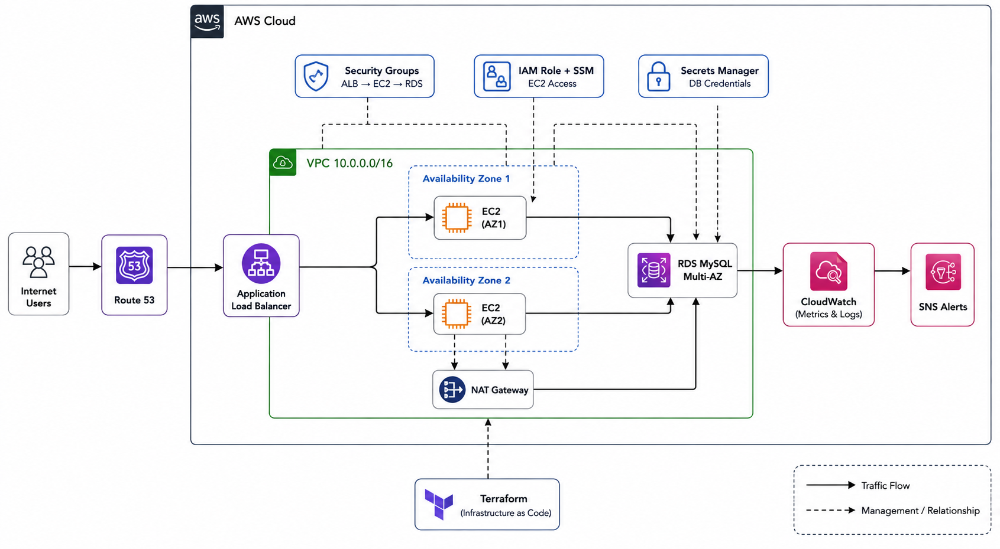

# Three-Tier Secure Highly Available AWS Infrastructure (Terraform)

**Status: v1.0 — locked.** Future changes get a new version and a
CHANGELOG entry, not silent edits.

[]()
[]()

## Overview

A three-tier AWS architecture — web (ALB), application (EC2/ASG), and
data (RDS Multi-AZ) — designed and implemented as Terraform, built while
studying for the AWS Solutions Architect Associate (SAA-C03)
certification.

## Architecture



Full write-up: [`architecture/architecture-specification.md`](architecture/architecture-specification.md)

## Deployment Status

This project's Terraform is written and validated (`terraform validate`
passes cleanly) but **not applied to a live AWS account**, to avoid
ongoing cost while it sits as a portfolio piece.

The screenshots in [`/screenshots`](screenshots/) are from hands-on
console configuration of the same services during SAA study — see
[`docs/console-walkthrough.md`](docs/console-walkthrough.md) for how
each one maps to the Terraform files.

## Services Used

| Service | Purpose |
|---|---|
| VPC, public/private subnets | Network isolation across 3 tiers |
| Internet Gateway / NAT Gateway | Public ingress / controlled private egress |
| Application Load Balancer | Layer 7 routing, health checks |
| Auto Scaling Group | Elasticity, self-healing |
| RDS MySQL (Multi-AZ) | Automatic failover |
| Secrets Manager | No hardcoded DB credentials |
| IAM Roles | No long-lived credentials on EC2 |
| CloudWatch + SNS | Alarming |

## Repository Structure

```text
three-tier-ha-aws/
├── architecture/     — design doc + diagrams
├── terraform/        — flat .tf files, validate-only
├── docs/             — decisions, security, cost, tradeoffs, interview prep
└── screenshots/      — hands-on AWS console evidence from SAA study
```

## Getting Started

```bash
cd terraform
cp terraform.tfvars.example terraform.tfvars   # fill in your own values
terraform init
terraform validate
terraform plan   # optional — shows what WOULD be created; not applied in this repo
```

## Learning Outcomes

VPC design, subnet tiering, security group least-privilege, RDS
Multi-AZ, Auto Scaling, IAM roles, Terraform fundamentals, and
translating hands-on console work into Infrastructure as Code.

## Future Improvements

- Live deployment on AWS free tier
- WAF on the ALB
- CI/CD pipeline (GitHub Actions)
- Custom least-privilege IAM policy for Secrets Manager access

## Author

**V. Srinivasan** — Cloud Engineering · AWS · Terraform